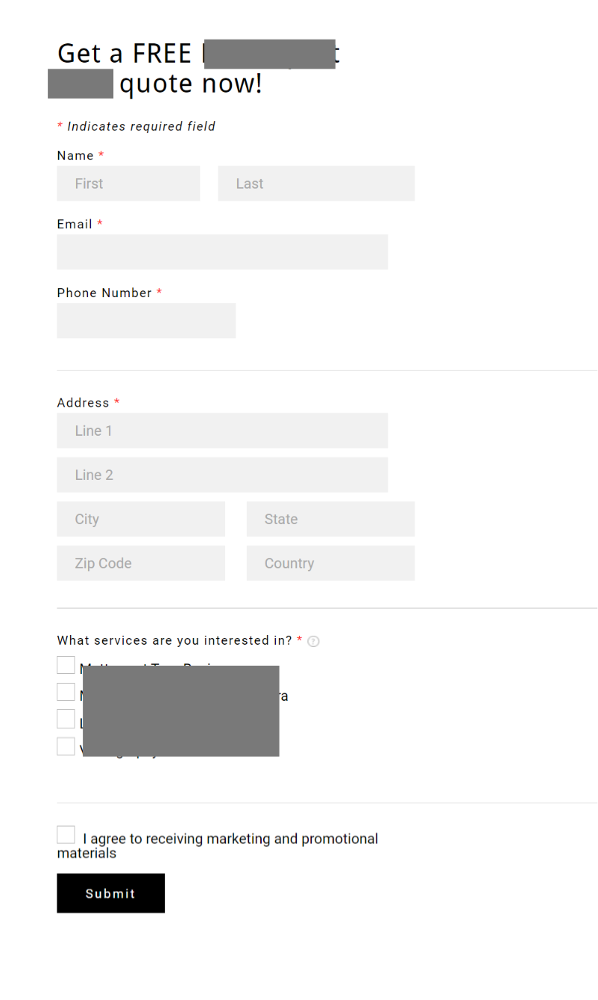

# Quote Creator App

This is a small part of a larger app. This quote creator allows users to order a service, the app then handles notifying involved parties of the service request for follow up.

## Situation

The client wanted to improve their top of funnel landing page to improve lead quality and lower lead cost.
Social media and search traffic was sent to the following landing page

While not terrible, there was certainly room for improvement.

## Actions

To make the form easier to digest for a user and reduce the bounce rate, I broke the inputs into their own sections. 

An additional benefit to separating out the form fields, is we can also do some further selling of the service 
as the customer goes through the form.

Inspiration was taken from Apple landing pages and other complex quote builder style landing pages.

This project is the final design iteration.

- Created components styled with Tailwind.css
- Added state management in the form for stepping through the quote creator
- Created types for the data for autocompletion
- Added backend processes for updating various systems on form submission

## Results

- 4% conversion rate increased to 7% conversion rate = ~75% lift in conversion rate
- 57% decrease in lead cost

## Learnings
 Here's why I think it worked:
- Quote price is transparent and upfront, building trust
- Customers follow a linear process, one question at a time, like a normal conversation would go
- Customers can learn more about the services and product differentiators through things like the "learn more" modals
- Customers get a professional and high-tech experience, increasing perceived brand value and perceived service value
- Customers get a clear idea of what to expect to next in the process of ordering this service

Some challenges were faced when deciding how to fetch the pricing data. I tried several different solutions,
but came to the conclusion that for this use case, since the pricing data does not change often (rarely), we can
simply cache the data using incremental static regeneration (ISR) in Next.js, that goes stale only once per hour. Significantly
reducing repeat requests made to the API. Lowering costs, and slightly increasing client side performance.
